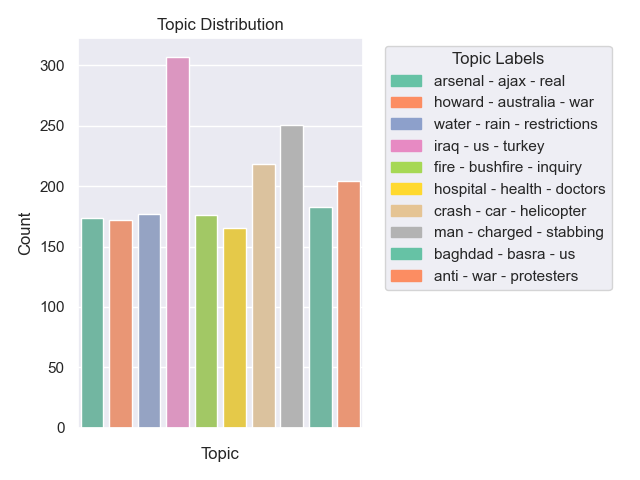

<!-- PROJECT LOGO -->
<br />
<p align="center">
  <h1 align="center">Cultural Data Science 2023</h1> 
  <h2 align="center">Assignment 5</h2> 
  <h3 align="center">Language Analytics</h3> 


  <p align="center">
    Aleksandrs Baskakovs
  </p>
</p>

<!-- ABOUT THE PROJECT -->
## About the project
This repository contains a Python script ```main.py``` that performs topic modelling on textual data using the ```BERTopic``` library. The script takes as input a dataset of text entries and outputs, a copy of the ```CSV``` file with a topic assigned to each data entry, as well as a visualization of a distribution of topics across the data. 

<!-- Data -->
## Data
The sample dataset used for this project is the **A Million News Headlines** dataset from Kaggle. The dataset contains over a million news headlines published over a period of 15 years. The data is stored in a single CSV file, with each row containing the headline text and the publish date. The dataset can be downloaded from the following link: https://www.kaggle.com/therohk/million-headlines. The code, however, can be used with any dataset of text entries in a CSV file.

<!-- Model -->
## Model
The topic modeling in this project is performed using ```BERTopic```, an extension of the ```BERT``` language model. BERTopic leverages pre-trained language embeddings to identify topics in textual data. For topic modeling, the ```all-MiniLM-L6-v2``` embedding model is utilized. The model is a sentence-transformers model: it maps sentences & paragraphs to a 384 dimensional dense vector space and can be used for tasks like clustering or semantic search. Visit https://huggingface.co/sentence-transformers/all-MiniLM-L6-v2 for more information about the model.

<!-- USAGE -->
## Usage
To use the code you need to adopt the following steps.

**NOTE:** Please note that the instructions provided here have been tested on a Mac machine running macOS Ventura 13.1, using Visual Studio Code version 1.76.0 (Universal) and a Unix-based bash terminal. While they should also be compatible with other Unix-based systems like Linux, slight variations may exist depending on the terminal and operating system you are using. To ensure a smooth installation process and avoid potential package conflicts, it is recommended to use the provided ```setup.sh``` bash file, which includes the necessary steps to create a virtual environment for the project. However, if you encounter any issues or have questions regarding compatibility on other platforms, please don't hesitate to reach out for assistance.

1. Clone repository
2. Run ``setup.sh`` in the terminal
3. Activate the virtual environment
4. Run ```main.py``` in the terminal
5. Deactivate the virtual environment

### Clone repository

Clone repository using the following lines in the your terminal:

```bash
git clone https://github.com/sashapustota/topic-modelling-with-BERT
cd topic-modelling-with-BERT
```

### Run ```setup.sh```

The ``setup.sh`` script is used to automate the installation of project dependencies and configuration of the environment. By running this script, you ensure consistent setup across different environments and simplify the process of getting the project up and running.

The script performs the following steps:

1. Creates a virtual environment for the project
2. Activates the virtual environment
3. Installs the required packages
4. Deactivates the virtual environment

To run the script, run the following line in the terminal:

```bash
bash setup.sh
```

### Activate virtual environment

To activate the newly created virtual environment, run the following line in the terminal:

```bash
source ./topic_modelling_with_BERT_venv/bin/activate
```

### Run ```main.py```

The ```main.py``` script performs the following steps:

1. Loads the data from the CSV file
2. Preprocesses the data
3. Performs topic modeling
4. Prints the generated topics in the rerminal, as well as saves them in .txt file
5. Saves a new CSV file with topics assigned to each data entry
6. Plots the results and saves the plot as a .png file

To use the script with the sample data, run the following line in the terminal:

```bash
python3 src/main.py
```

If you are using your own data, the script allows for the following optional arguments:

```
main.py [-h] [--data DATA] [--column COLUMN] [--n_topics LABEL]

options:
  --data DATA     Name of the CSV file to use. (default: abcnews-date-text.csv)
  --column COLUMN Name of the column with text data in the CSV file. (default: headline_text)
  --n_topics N_TOPICS Number of topics to extract. (default: 10)
```

For example, if you have a CSV file named ```my_data.csv``` with text data in the column ```text```, and want to extract 12 topics, you can run the following line in the terminal:

```bash
python3 src/main.py --data my_data.csv --column text --n_topics 12
```

### Deactivate virtual environment

When you are done using the script, you can deactivate the virtual environment by running the following line in the terminal:

```bash
deactivate
```

<!-- REPOSITORY STRUCTURE -->
## Repository structure
This repository has the following structure:
```
│   .gitignore
│   README.md
│   requirements.txt
│   setup.sh
│
├───data
│       .gitkeep
│
├───out
│       sample_topic_distribution.png       
│
└───src
        main.py

```
<!-- RESULTS -->
## Results
The following results were obtained using the first 10,000 rows of the headline dataset and using the default arguments for the ```main.py``` script.

Topics generated:
```
    Topic  Count                                  Name                   CustomName
0      -1   7973                -1_us_govt_iraq_police             us - govt - iraq
1       0    307                0_iraq_us_turkey_iraqi           iraq - us - turkey
2       1    251          1_man_charged_stabbing_court     man - charged - stabbing
3       2    218           2_crash_car_helicopter_dies     crash - car - helicopter
4       3    204         3_anti_war_protesters_protest      anti - war - protesters
5       4    183             4_baghdad_basra_us_forces         baghdad - basra - us
6       5    177       5_water_rain_restrictions_river  water - rain - restrictions
7       6    176  6_fire_bushfire_inquiry_firefighters    fire - bushfire - inquiry
8       7    174             7_arsenal_ajax_real_leeds        arsenal - ajax - real
9       8    172         8_howard_australia_war_troops     howard - australia - war
10      9    165     9_hospital_health_doctors_medical  hospital - health - doctors
```

Topic distribution:
